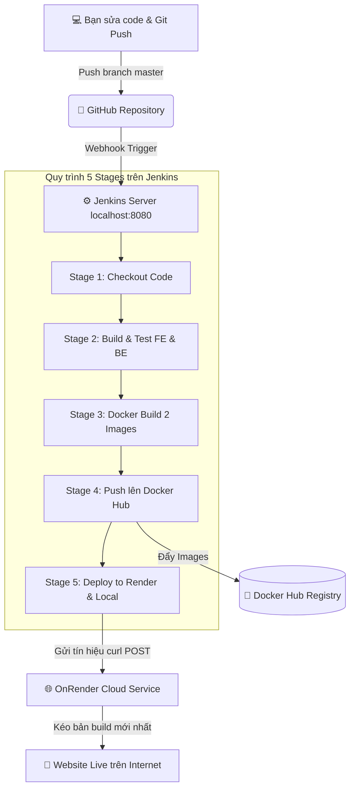

# 📘 HƯỚNG DẪN TỪ A-Z: CI/CD DỰ ÁN VỚI JENKINS, DOCKER, GITHUB & ONRENDER
### DỰ ÁN THƯƠNG MẠI ĐIỆN TỬ NHÓM 10 - ST23D (REACTJS + NODE.JS + MYSQL)

---

## 🧭 MỤC LỤC
1. [Tổng quan luồng hoạt động](#1-tổng-quan-luồng-hoạt-động)
2. [Chuẩn bị trước khi làm](#2-chuẩn-bị-trước-khi-làm)
3. [Bước 1: Khởi động Jenkins trên máy cá nhân](#bước-1-khởi-động-jenkins-trên-máy-cá-nhân)
4. [Bước 2: Lấy Deploy Hook từ OnRender](#bước-2-lấy-deploy-hook-từ-onrender)
5. [Bước 3: Cấu hình Credentials trong Jenkins](#bước-3-cấu-hình-credentials-trong-jenkins)
6. [Bước 4: Kiểm tra Job Pipeline trên Jenkins](#bước-4-kiểm-tra-job-pipeline-trên-jenkins)
7. [Bước 5: Cấu hình Webhook GitHub (Tự động kích hoạt)](#bước-5-cấu-hình-webhook-github-tự-động-kích-hoạt)
8. [Bước 6: Chạy Pipeline & Kiểm tra kết quả](#bước-6-chạy-pipeline--kiểm-tra-kết-quả)
9. [Kịch bản Demo ghi điểm tối đa với Thầy](#-kịch-bản-demo-ghi-điểm-tối-đa-với-thầy)
10. [Xử lý các lỗi thường gặp (Troubleshooting)](#-xử-lý-các-lỗi-thường-gặp)

---

## 1. TỔNG QUAN LUỒNG HOẠT ĐỘNG

Thay vì deploy thủ công hoặc chỉ kết nối GitHub thẳng vào Render, hệ thống của bạn áp dụng **mô hình CI/CD chuẩn doanh nghiệp** theo đúng yêu cầu của Thầy:



### 💡 Tại sao mô hình này đạt điểm tối đa?
1. **Đáp ứng 100% yêu cầu của Thầy:** Có Jenkins quản lý Pipeline tập trung, kiểm tra code, tự động hóa toàn bộ, có đóng gói Docker và đẩy lên Docker Hub.
2. **Tiện lợi và thực tế:** Không cần tốn tiền thuê VPS Linux riêng (đắt đỏ, khó cấu hình SSL), website vẫn chạy mượt mà trên **OnRender**.
3. **Trực quan:** Thầy vừa thấy bảng điều khiển Pipeline xanh mướt trên Jenkins, vừa bấm link web trên Render xem kết quả ngay lập tức.

---

## 2. CHUẨN BỊ TRƯỚC KHI LÀM

| Công cụ | Trạng thái hiện tại | Nhiệm vụ |
|---|---|---|
| **GitHub Repo** | `devvd25/dangcongvu.reactjs.ecommerce` | Nơi lưu trữ mã nguồn |
| **Jenkins** | Thư mục `jenkins_home` trong dự án | Đã có sẵn tài khoản `devvd25` và `github-cred` |
| **Docker Desktop** | Đã cài trên máy | Cần bật lên trước khi chạy Jenkins |
| **Docker Hub** | [hub.docker.com](https://hub.docker.com/) | Tài khoản để lưu trữ Docker Images |
| **OnRender** | [dashboard.render.com](https://dashboard.render.com/) | Nơi ứng dụng đang được host |

---

## BƯỚC 1: KHỞI ĐỘNG JENKINS TRÊN MÁY CÁ NHÂN

> [!IMPORTANT]
> **Bắt buộc:** Bạn phải mở ứng dụng **Docker Desktop** trên Windows trước, chờ biểu tượng góc dưới chuyển sang màu xanh lá (*Engine running*).

1. Mở thư mục dự án:  
   `E:\Lap trinh ReactJS (3tc)\DỰ ÁN MÔN REACTJS - NHÓM 10\DỰ ÁN MÔN REACTJS - NHÓM 10\Nhóm 10 - ST23D - 2024\`
2. Nhấp đúp chuột vào file:  
   👉 **`start-jenkins.bat`**
3. Cửa sổ dòng lệnh sẽ tự động tải image Jenkins và chạy container `myjenkins`.
4. Khi màn hình hiện thông báo hoàn tất, mở trình duyệt vào địa chỉ:  
   👉 **`http://localhost:8080`**
5. Đăng nhập với tài khoản:
   - **Username:** `devvd25`
   - **Password:** Mật khẩu Jenkins bạn đã đặt trước đó.

---

## BƯỚC 2: LẤY DEPLOY HOOK TỪ ONRENDER

Deploy Hook là chiếc "chìa khóa" để Jenkins ra lệnh cho Render cập nhật code mới:

1. Đăng nhập vào: **[https://dashboard.render.com](https://dashboard.render.com)**
2. Nhấp vào **Web Service** của dự án bạn đang chạy.
3. Ở menu bên trái, chọn **Settings** (Cài đặt).
4. Cuộn xuống phần **Deploy Hook**, bạn sẽ thấy một đường link dạng:
   ```text
   https://api.render.com/deploy/srv-xxxxxxxxxxxxxxxxxxxx?key=yyyyyyyyyy
   ```
5. Nhấn nút **Copy** để lưu đường link này vào bộ nhớ tạm.

---

## BƯỚC 3: CẤU HÌNH CREDENTIALS TRONG JENKINS

Để Jenkins có quyền đẩy Docker image và kích hoạt Render, bạn thêm 2 thông tin sau:

1. Trên giao diện Jenkins, vào:  
   **Manage Jenkins** ➔ **Credentials** ➔ **System** ➔ **Global credentials (unrestricted)**.
2. Nhấn nút **Add Credentials** (ở góc phải):

### Credential 1: Docker Hub (`dockerhub-cred`)
- **Kind:** `Username with password`
- **Username:** Tên đăng nhập Docker Hub của bạn (ví dụ: `devvd25`)
- **Password:** Mật khẩu Docker Hub (hoặc Personal Access Token tạo từ hub.docker.com)
- **ID:** `dockerhub-cred` *(ghi chính xác chữ này)*
- **Description:** `Docker Hub Credentials`
- Nhấn **Create**.

### Credential 2: Render Deploy Hook (`render-deploy-hook`)
- Nhấn tiếp **Add Credentials**:
- **Kind:** `Secret text`
- **Secret:** Dán đường link Deploy Hook vừa copy ở Bước 2
- **ID:** `render-deploy-hook` *(ghi chính xác chữ này)*
- **Description:** `Render Deploy Hook URL`
- Nhấn **Create**.

> [!NOTE]
> Credential `github-cred` đã có sẵn trong hệ thống của bạn từ trước nên bạn **không cần tạo lại GitHub PAT**.

---

## BƯỚC 4: KIỂM TRA JOB PIPELINE TRÊN JENKINS

Em đã cấu hình sẵn Job cho bạn:

1. Quay lại trang chủ Jenkins Dashboard (`http://localhost:8080`).
2. Bạn sẽ thấy ngay một Job có tên là: **`Ecommerce-CICD`**.
3. Bấm vào **`Ecommerce-CICD`** ➔ Chọn **Configure** để xem cấu hình:
   - Mục **Pipeline**: Đã trỏ sẵn đến GitHub `devvd25/dangcongvu.reactjs.ecommerce.git`.
   - **Branch Specifier:** `*/master`.
   - **Script Path:** `Jenkinsfile`.
   - **GitHub hook trigger for GITScm polling:** Đã được tích bật.

---

## BƯỚC 5: CẤU HÌNH WEBHOOK GITHUB (TỰ ĐỘNG KÍCH HOẠT)

Để mỗi khi bạn `git push` lên GitHub thì Jenkins tự động chạy:

1. Vào repository trên GitHub: [https://github.com/devvd25/dangcongvu.reactjs.ecommerce](https://github.com/devvd25/dangcongvu.reactjs.ecommerce).
2. Chọn tab **Settings** (Cài đặt của Repo) ➔ Chọn **Webhooks** ở cột trái ➔ Bấm **Add webhook**.
3. Điền thông tin:
   - **Payload URL:**  
     - Nếu Jenkins chạy trên VPS hoặc có domain: `http://<IP-HOAC-DOMAIN>:8080/github-webhook/`
     - Nếu chạy local, bạn dùng **Ngrok** để mở cổng:  
       Chạy lệnh: `ngrok http 8080`  
       Copy URL ngrok (dạng `https://xxxx.ngrok-free.app/github-webhook/`) dán vào Payload URL.
   - **Content type:** Chọn `application/json`
   - **Which events...:** Chọn `Just the push event`
   - **Active:** Tích chọn
4. Bấm **Add webhook**.

---

## BƯỚC 6: CHẠY PIPELINE & KIỂM TRA KẾT QUẢ

### Cách 1: Chạy thủ công lần đầu (Khuyên dùng để test)
1. Vào trang Job **`Ecommerce-CICD`** trên Jenkins.
2. Bấm **Build Now** ở menu bên trái.
3. Quan sát mục **Stage View**, bạn sẽ thấy 5 giai đoạn chạy tuần tự:
   - 🟢 **Checkout:** Kéo code thành công.
   - 🟢 **Build & Test:** Kiểm tra build React Vite và syntax Node.js thành công.
   - 🟢 **Docker Build:** Đóng gói image Frontend & Backend.
   - 🟢 **Push Docker Hub:** Đẩy images lên kho chứa Docker Hub.
   - 🟢 **Deploy:** Bắn tín hiệu sang Render cập nhật website!

### Cách 2: Chạy tự động bằng Git Push
1. Mở code, sửa một dòng nhỏ (ví dụ đổi tiêu đề ở Footer hoặc Banner).
2. Chạy lệnh:
   ```bash
   git add .
   git commit -m "feat: cap nhat giao dien va test CI/CD"
   git push origin master
   ```
3. Mở Jenkins lên, bạn sẽ thấy bản build mới **tự động kích hoạt chạy** mà không cần đụng tay!

---

## 🎯 KỊCH BẢN DEMO GHI ĐIỂM TỐI ĐA VỚI THẦY

Khi thuyết trình hoặc vấn đáp, bạn thực hiện theo 4 bước sau để tạo ấn tượng mạnh:

### Bước 1: Giới thiệu kiến trúc hệ thống
> *"Thưa Thầy, nhóm em đã xây dựng luồng CI/CD hoàn chỉnh kết hợp giữa GitHub, Jenkins, Docker và OnRender. Jenkins đóng vai trò là Orchestrator trung tâm để tự động kiểm thử, đóng gói Docker images và kích hoạt triển khai lên server."*

### Bước 2: Trình diễn Jenkins Pipeline
- Mở màn hình Jenkins: Chỉ cho Thầy thấy pipeline gồm **5 Stages** trực quan.
- Bấm vào lịch sử build gần nhất, mở **Console Output** để Thầy thấy:
  - Code được pull tự động qua SSH/PAT.
  - Quá trình chạy test build của Vite và Node.js.
  - Quá trình build Docker và push image lên Docker Hub.

### Bước 3: Trình diễn tự động hóa (Live Demo)
- Bạn mở VS Code, sửa nhanh 1 đoạn chữ trên giao diện (ví dụ: thêm dòng chữ *"Chào mừng Thầy và các bạn"* vào trang chủ).
- Thực hiện `git commit` và `git push`.
- Mời Thầy nhìn màn hình Jenkins: Pipeline **tự động bắt sự kiện Webhook và bắt đầu build**.

### Bước 4: Kiểm tra kết quả Live
- Khi Stage 5 (Deploy) chuyển sang màu xanh lá:
- Bạn mở đường link `xxx.onrender.com` của nhóm và tải lại trang.
- Dòng chữ vừa sửa đã xuất hiện trực tiếp trên internet mà không cần bất kỳ thao tác thủ công nào trên server!

---

## 🛠️ XỬ LÝ CÁC LỖI THƯỜNG GẶP

### 1. Lỗi: `Cannot connect to the Docker daemon`
- **Nguyên nhân:** Chưa bật ứng dụng Docker Desktop trên Windows.
- **Khắc phục:** Mở Docker Desktop từ Start Menu, đợi hiện *Engine running*, sau đó chạy lại `start-jenkins.bat`.

### 2. Lỗi: `docker login failed` hoặc `denied: requested access to the resource is denied`
- **Nguyên nhân:** Sai username/password trong credential `dockerhub-cred`.
- **Khắc phục:** Kiểm tra lại tài khoản trên hub.docker.com, cập nhật lại password/token trong Jenkins (`Manage Jenkins` -> `Credentials`).

### 3. Lỗi: `Port 8080 already in use`
- **Nguyên nhân:** Có phần mềm khác (hoặc container Jenkins cũ) đang chiếm cổng 8080.
- **Khắc phục:** Chạy lệnh PowerShell:
  ```powershell
  docker ps -a
  docker rm -f myjenkins
  ```
  Sau đó chạy lại `start-jenkins.bat`.

### 4. Lỗi: `curl: (22) The requested URL returned error: 404` khi deploy Render
- **Nguyên nhân:** Copy thiếu hoặc sai link Deploy Hook.
- **Khắc phục:** Vào lại Render Dashboard -> Settings -> Copy lại chính xác toàn bộ đường link dán vào credential `render-deploy-hook`.
